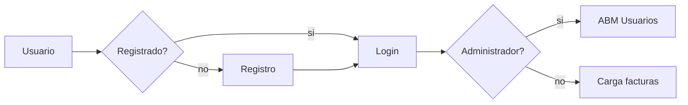

# Trabajo Práctico P.O.O. | Grupo 6
Sistema de gestión de usuarios y carga de facturas.

**Integrantes**:
Diaz Agustin,
Cardú Nahuel,
Di Prinzio Luciano,
Hernández Pablo.

## Funcionamiento
**Pantalla bienvenida**:
- Si el usuario ya está registrado:
Ingresar nombre, contraseña y pulsar [Login]
- Si el usuario no está registrado:
Ingresar Nombre, Email, Contraseña, DNI y pulsar [Registrar]. Si los datos ingresados son correctos conforme al formato entonces se registra al usuario. Sino se le informa que revise los datos ingresados.

**Pantalla cliente**:
- Ingresar Numero de factura y pulsar agregar. Solo permite ingresar números
- Botón [Salir] te envía al a pantalla Bienvenida

**Pantalla admin**:
Se muestra en una tabla los datos de los usuarios registrados.
- Puede cargar nuevos usuarios completando los campos y pulsando [Agregar].
- Puede modificar usuarios seleccionándolos por su ID, realizando los cambios y luego pulsando [Modificar]
- Puede eliminar usuarios seleccionándolos por su ID y pulsando [Eliminar]
- Botón [Salir] te envía al a pantalla Bienvenida

**Tipos de usuario**:
- **Cliente**: Acceso a pantalla de carga de facturas.
- **Administrador**: Acceso a pantalla de gestión de usuarios. Puede consultar, agregar, eliminar y modificar usuarios del sistema.

## Especificaciones técnicas
**Tecnologías empleadas**:
[C#](https://docs.microsoft.com/en-us/dotnet/csharp/)
[SQL Server 15.2.2000.5](https://www.microsoft.com/es-es/sql-server/sql-server-downloads)
